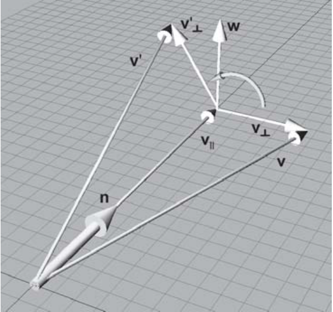
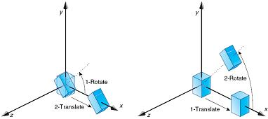
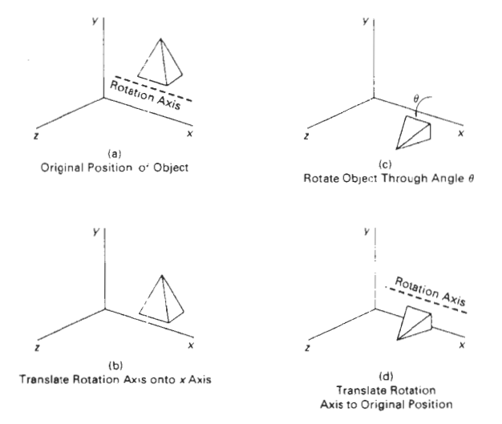
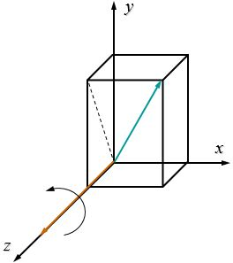
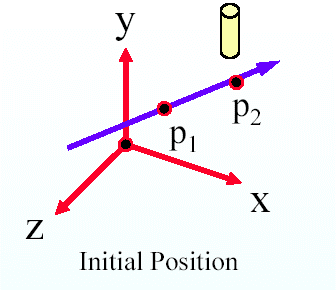
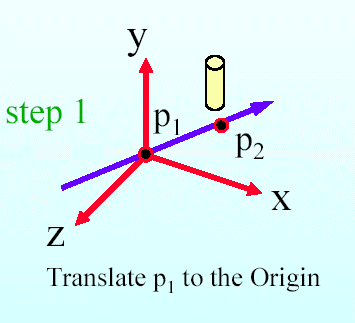
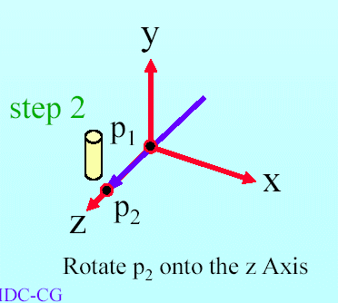
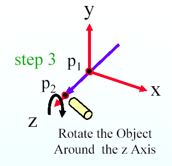
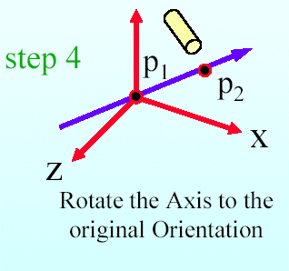
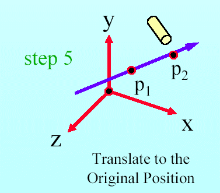

<section id="themes">
	<h2>Themes</h2>
		<p>
			Set your presentation theme: <br>
			<!-- Hacks to swap themes after the page has loaded. Not flexible and only intended for the reveal.js demo deck. -->
                        <a href="#" onclick="document.getElementById('theme').setAttribute('href','css/theme/black.css'); return false;">Black (default)</a> -
			<a href="#" onclick="document.getElementById('theme').setAttribute('href','css/theme/white.css'); return false;">White</a> -
			<a href="#" onclick="document.getElementById('theme').setAttribute('href','css/theme/league.css'); return false;">League</a> -
			<a href="#" onclick="document.getElementById('theme').setAttribute('href','css/theme/sky.css'); return false;">Sky</a> -
			<a href="#" onclick="document.getElementById('theme').setAttribute('href','css/theme/beige.css'); return false;">Beige</a> -
			<a href="#" onclick="document.getElementById('theme').setAttribute('href','css/theme/simple.css'); return false;">Simple</a> <br>
			<a href="#" onclick="document.getElementById('theme').setAttribute('href','css/theme/serif.css'); return false;">Serif</a> -
			<a href="#" onclick="document.getElementById('theme').setAttribute('href','css/theme/blood.css'); return false;">Blood</a> -
			<a href="#" onclick="document.getElementById('theme').setAttribute('href','css/theme/night.css'); return false;">Night</a> -
			<a href="#" onclick="document.getElementById('theme').setAttribute('href','css/theme/moon.css'); return false;">Moon</a> -
			<a href="#" onclick="document.getElementById('theme').setAttribute('href','css/theme/solarized.css'); return false;">Solarized</a>
		</p>
</section>

H:

# Transformations

Jean Pierre Charalambos

H:

## Index

 1. Intro<!-- .element: class="fragment" data-fragment-index="1"-->
    * Active vs pasive transformations
    * Shaders
 2. Linear transformations<!-- .element: class="fragment" data-fragment-index="2"-->
    * Scaling, rotation & shearing
 3. Affine transformations<!-- .element: class="fragment" data-fragment-index="3"-->
    * Homogeneous space
    * Translation
    * Scaling, rotation & shearing revisited
    * Matrix operations: inversion, composition

V:

## Index (part 2)

 4. Modelling and view<!-- .element: class="fragment" data-fragment-index="4"-->
 5. Projections<!-- .element: class="fragment" data-fragment-index="5"-->
    * Orthogonal
    * Perspective

H:

## Intro: Active vs pasive transformations

<font color="yellow"> Active Transformation (standard basis) vs Passive Transformation (change of basis)</font>


N:

* Standard = Canonical

V:

## Intro: Shaders

<div class="ulist">
    
    <ul style="width: 30%;">
        <p class="fragment" data-fragment-index="1">Vertex shader</p>
        <p class="fragment" data-fragment-index="2">Fragment shader</p>
    </ul>
</div>

V:

## Intro: Shaders
### Vertex shader: pseudo code

```glsl
for (int i = 0; i < vertexCount; i++) {
  output = vertexShader(vertex[i]);
}

function vertexShader(vertex) {
  projPos = projection * modelview * vertex.position;
  litColor = lightColor * dot(vertex.normal, lightDirection);
  return (projPos, litColor);
}
```

V:

## Intro: Shaders
### Vertex shader

```glsl
uniform mat4 transform;
attribute vec4 vertex;
attribute vec4 color;
varying vec4 vertColor;

void main() {
   gl_Position = transform * vertex;
   vertColor = color;
}
```

V:

## Intro: Shaders
### Vertex shader: glsl code for active *transform*

```glsl
uniform mat4 transform;
attribute vec4 vertex;
attribute vec4 color;
varying vec4 vertColor;

void main() {
   gl_Position = transform * vertex;
   vertColor = color;
}
```

1. `transform = projection`

V:

## Intro: Shaders
### Vertex shader: glsl code for passive *transform*

```glsl
uniform mat4 transform;
attribute vec4 vertex;
attribute vec4 color;
varying vec4 vertColor;

void main() {
   gl_Position = transform * vertex;
   vertColor = color;
}
```

1. `transform = projection * modelview`
2. `transform = projection * view * model`

(<a href="#/5/15">goto matrix composition</a> and then to <a href="#/6/12">eye transform</a>)

V:

## Intro: Shaders
### Fragment shader: pseudo code

```glsl
for (int i = 0; i < fragmentCount; i++) {
  screenBuffer[fragment[i].xy] = fragmentShader(fragment[i]);
}

function fragmentShader(fragment) {
  return fragment.litColor;
}
```

V:

## Intro: Shaders
### Fragment shader: glsl code

```glsl
varying vec4 vertColor;

void main() {
  gl_FragColor = vertColor;
}
```

V:

## Intro: Shaders
### GLSL variable types

<li class="fragment"> _uniform_: variables that remain constant for each vertex in the scene. Example: `uniform mat4 transform`
<li class="fragment"> _attribute_: variables that change from vertex to vertex. Examples: `attribute vec4 vertex`, `attribute vec4 color`
<li class="fragment"> _varying_:  variables that are exchanged between the vertex and the fragment shaders. Example: `varying vec4 vertColor`

V:

## Intro: Shaders
### Common GLSL uniform variables emitted by P5

| Name         | Alias              | Type        |
|--------------|--------------------|-------------|
| `transform`  | `transformMatrix`  | `mat4`      |
| `modelview`  | `modelviewMatrix`  | `mat4`      |
| `projection` | `projectionMatrix` | `mat4`      |
| `texture`    | `texMap`           | `sampler2D` |

V:

## Intro: Shaders
### Common GLSL attribute variables emitted by P5

| Name                      | Type   |
|---------------------------|--------|
| `position` (or, `vertex`) | `vec4` |
| `color`                   | `vec4` |
| `normal`                  | `vec3` |

V:

## Intro: Shaders
### Processing shader API: [PShader](https://processing.org/reference/PShader.html)

> Class that encapsulates a GLSL shader program, including a vertex and a fragment shader

V:

## Intro: Shaders
### Processing shader API: [loadShader()](https://processing.org/reference/loadShader_.html)

> Loads a shader into the PShader object

Method signatures

```processing
  loadShader(fragFilename)
  loadShader(fragFilename, vertFilename)
```
<!-- .element: class="fragment" data-fragment-index="1"-->

Example

```processing
  PShader unalShader;
  void setup() {
    ...
    //when no path is specified it looks in the sketch 'data' folder
    unalShader = loadShader("unal_frag.glsl", "unal_vert.glsl");
  }
```
<!-- .element: class="fragment" data-fragment-index="2"-->

V:

## Intro: Shaders
### Processing shader API: [shader()](https://processing.org/reference/shader_.html)

> Applies the specified shader

Method signature

```processing
  shader(shader)
```
<!-- .element: class="fragment" data-fragment-index="1"-->

Example

```processing
  PShader simpleShader, unalShader;
  void draw() {
    ...
    shader(simpleShader);
    simpleGeometry();
    shader(unalShader);
    unalGeometry();
  }
```
<!-- .element: class="fragment" data-fragment-index="2"-->

V:

## Intro: Shaders
### Processing shader API: [resetShader()](https://processing.org/reference/resetShader_.html)

> Restores the default shaders

Method signatures

```processing
  resetShader()
```
<!-- .element: class="fragment" data-fragment-index="1"-->

Example

```processing
    PShader simpleShader;
  void draw() {
    ...
    shader(simpleShader);
    simpleGeometry();
    resetshader();
    otherGeometry();
  }
```
<!-- .element: class="fragment" data-fragment-index="2"-->

V:

## Intro: Shaders
### Processing shader API: [PShader.set()](https://processing.org/reference/PShader_set_.html)

> Sets the uniform variables inside the shader to modify the effect while the program is running

Method signatures for vector uniform variables `vec2`, `vec3` or `vec4`:

```processing
  .set(name, x)
  .set(name, x, y)
  .set(name, x, y, z)
  .set(name, x, y, z, w)
  .set(name, vec)
```

* *name*: of the uniform variable to modify
* *x*, *y*, *z* and *w*: 1st, snd, 3rd and 4rd vec float components resp.
* *vec*: PVector

V:

## Intro: Shaders
### Processing shader API: [PShader.set()](https://processing.org/reference/PShader_set_.html)

> Sets the uniform variables inside the shader to modify the effect while the program is running

Method signatures for vector uniform variables `boolean[]`, `float[]`, `int[]`:

```processing
  .set(name, x)
  .set(name, x, y)
  .set(name, x, y, z)
  .set(name, x, y, z, w)
  .set(name, vec)
```

* *name*: of the uniform variable to modify
* *x*, *y*, *z* and *w*: 1st, snd, 3rd and 4rd vec (boolean, float or int) components resp.
* *vec*: boolean[], float[], int[]

V:

## Intro: Shaders
### Processing shader API: [PShader.set()](https://processing.org/reference/PShader_set_.html)

> Sets the uniform variables inside the shader to modify the effect while the program is running

Method signatures for `mat3` and `mat4` uniform variables:

```processing
  .set(name, mat) // mat is PMatrix2D, or PMatrix3D
```

* *name* of the uniform variable to modify
* *mat* PMatrix3D, or PMatrix2D

V:

## Intro: Shaders
### Processing shader API: [PShader.set()](https://processing.org/reference/PShader_set_.html)

> Sets the uniform variables inside the shader to modify the effect while the program is running

Method signatures for vector uniform variables:

```processing
  .set(name, tex) // tex is a PImage
```

V:

## Intro: Shaders
### Processing shader API: [PShader.set()](https://processing.org/reference/PShader_set_.html)

> Sets the uniform variables inside the shader to modify the effect while the program is running

Example:

```processing
  PShader unalShader;
  PMatrix3D projectionModelView1, projectionModelView2;
  void draw() {
    ...
    shader(unalShader);
    unalShader.set("unalMatrix", projectionModelView1);
    unalGeometry1();
    unalShader.set("unalMatrix", projectionModelView2);
    unalGeometry2();
  }
```
<!-- .element: class="fragment" data-fragment-index="1"-->

H:

## Linear transformations: Notion

Property 1<!-- .element: class="fragment" data-fragment-index="1"-->
   $$F(a+b)= F(a)+ F(b)$$

Property 2<!-- .element: class="fragment" data-fragment-index="2"-->
   $$F(\lambda a) = \lambda F(a)\rightarrow F(0) = 0$$

Observation 1:<!-- .element: class="fragment" data-fragment-index="3"-->
   Matrix multiplication is always linear

Observation 2:<!-- .element: class="fragment" data-fragment-index="4"-->
   Translation is a nonlinear transformation

V:

## Linear transformations: 2d scaling

<div class="ulist">
    
    <ul style="width: 57%;">
        <p class="fragment" data-fragment-index="1">
        `$x'= sx*x$`
        </p>
        <p class="fragment" data-fragment-index="2">
        `$y'= sy*y$`
        </p>
        <p class="fragment" data-fragment-index="3">
        `$\begin{bmatrix}
        x' \cr
        y' \cr
        \end{bmatrix}
        =
        \begin{bmatrix}
        sx & 0 \cr
        0 & sy \cr
        \end{bmatrix} \bullet \begin{bmatrix}
        x \cr
        y \cr
        \end{bmatrix}
        $`
        </p>
        <p class="fragment" data-fragment-index="4">
        $P'= S(sx,sy) \bullet P$
        </p>
    </ul>
</div>

N:

* mirroring and reflections are missed

V:

## Linear transformations: 3d scaling

<div class="ulist">
    
    <ul style="width: 65%;">
        <p class="fragment" data-fragment-index="1">
        `$x'= sx*x$`
        </p>
        <p class="fragment" data-fragment-index="2">
        `$y'= sy*y$`
        </p>
        <p class="fragment" data-fragment-index="3">
        `$z'= sz*z$`
        </p>
        <p class="fragment" data-fragment-index="4">
        `$\begin{bmatrix}
        x' \cr
        y' \cr
        z' \cr
        \end{bmatrix}
        =
        \begin{bmatrix}
        sx & 0 & 0 \cr
        0 & sy & 0 \cr
        0 & 0 & sz \cr
        \end{bmatrix} \bullet \begin{bmatrix}
        x \cr
        y \cr
        z \cr
        \end{bmatrix}
        $`
        </p>
        <p class="fragment" data-fragment-index="5">
        $P'= S(sx,sy,sz) \bullet P$
        </p>
    </ul>
</div>

N:

* mirroring and reflections are missed

V:

## Linear transformations: 2d rotation

<div class="ulist">
    
    <ul style="width: 57%;">        
        <p class="fragment" data-fragment-index="1">
        $x = rcos \alpha$
        </p>
        <p class="fragment" data-fragment-index="2">
        $y= rsin \alpha$
        </p>
        <p class="fragment" data-fragment-index="3">
        $x'= rcos (\alpha+\beta)$
        $x'= rcos \alpha cos \beta - rsin \alpha sin \beta$
        </p>
        <p class="fragment" data-fragment-index="4">
        $y'= rsin (\alpha+\beta)$
        $y'= rcos \alpha sin \beta - rsin \alpha cos \beta$
        </p>
    </ul>
</div>

V:

## Linear transformations: 2d Rotation

<div class="ulist">
    
    <ul style="width: 57%;">        
        <p class="fragment" data-fragment-index="1">
        `$\begin{bmatrix}
        x' \cr
        y' \cr
        \end{bmatrix}
        =
        \begin{bmatrix}
        cos\beta & -sin \beta \cr
        sin\beta & cos \beta \cr
        \end{bmatrix} \bullet \begin{bmatrix}
        x \cr
        y \cr
        \end{bmatrix}
        $`
        </p>
        <p class="fragment" data-fragment-index="2">
        $P'= R(\beta) \bullet P$
        </p>
    </ul>
</div>

V:

## Linear transformations: 3d rotation
### Euler angles (respect to z-axis)

<div class="ulist">
    
    <ul style="width: 67%;">
        <p class="fragment" data-fragment-index="1">
        $z' = z$
        </p>
        <p class="fragment" data-fragment-index="2">
        `$\begin{bmatrix}
        x' \cr
        y' \cr
        z' \cr
        \end{bmatrix}
        =
        \begin{bmatrix}
        cos\beta & -sin \beta & 0 \cr
        sin\beta & cos \beta & 0 \cr
        0 & 0 & 1 \cr
        \end{bmatrix} \bullet \begin{bmatrix}
        x \cr
        y \cr
        z \cr
        \end{bmatrix}
        $`
        </p>
        <p class="fragment" data-fragment-index="3">
        $P'= R_z(\beta) \bullet P$
        </p>
    </ul>
</div>

V:

## Linear transformations: 3d rotation
### Euler angles (respect to x-axis)

<div class="ulist">
    
    <ul style="width: 67%;">
        <p class="fragment" data-fragment-index="1">
        $x' = x$
        </p>
        <p class="fragment" data-fragment-index="2">
        `$\begin{bmatrix}
        x' \cr
        y' \cr
        z' \cr
        \end{bmatrix}
        =
        \begin{bmatrix}
        1 & 0 & 0 \cr
        0 & cos\beta & -sin \beta \cr
        0 & sin\beta & cos \beta \cr
        \end{bmatrix} \bullet \begin{bmatrix}
        x \cr
        y \cr
        z \cr
        \end{bmatrix}
        $`
        </p>
        <p class="fragment" data-fragment-index="3">
        $P'= R_x(\beta) \bullet P$
        </p>
    </ul>
</div>

V:

## Linear transformations: 3d rotation
### Euler angles (respect to y-axis)

<div class="ulist">
    
    <ul style="width: 67%;">
        <p class="fragment" data-fragment-index="1">
        $y' = y$
        </p>
        <p class="fragment" data-fragment-index="2">
        `$\begin{bmatrix}
        x' \cr
        y' \cr
        z' \cr
        \end{bmatrix}
        =
        \begin{bmatrix}
        cos\beta & 0 & sin \beta \cr
        0 & 1 & 0 \cr
        -sin\beta & 0 & cos \beta \cr
        \end{bmatrix} \bullet \begin{bmatrix}
        x \cr
        y \cr
        z \cr
        \end{bmatrix}
        $`
        </p>
        <p class="fragment" data-fragment-index="3">
        $P'= R_y(\beta) \bullet P$
        </p>
    </ul>
</div>

V:

## Linear transformations: 2d shearing

<div class="ulist">
    
    <ul style="width: 57%;">
        <p class="fragment" data-fragment-index="1">
        `$x'= x + h*y$`
        </p>
        <p class="fragment" data-fragment-index="2">
        `$y'=y$`
        </p>
        <p class="fragment" data-fragment-index="3">
        `$\begin{bmatrix}
        x' \cr
        y' \cr
        \end{bmatrix}
        =
        \begin{bmatrix}
        1 & h \cr
        0 & 1 \cr
        \end{bmatrix} \bullet \begin{bmatrix}
        x \cr
        y \cr
        \end{bmatrix}
        $`
        </p>
        <p class="fragment" data-fragment-index="4">
        $P'= D_x(h) \bullet P$
        </p>
    </ul>
</div>

V:

## Linear transformations: 2d shearing

<div class="ulist">
    
    <ul style="width: 57%;">
        <p class="fragment" data-fragment-index="1">
        `$x'= x$`
        </p>
        <p class="fragment" data-fragment-index="2">
        `$y'=y + h*x$`
        </p>
        <p class="fragment" data-fragment-index="3">
        `$\begin{bmatrix}
        x' \cr
        y' \cr
        \end{bmatrix}
        =
        \begin{bmatrix}
        1 & 0 \cr
        h & 1 \cr
        \end{bmatrix} \bullet \begin{bmatrix}
        x \cr
        y \cr
        \end{bmatrix}
        $`
        </p>
        <p class="fragment" data-fragment-index="4">
        $P'= D_y(h) \bullet P$
        </p>
    </ul>
</div>

V:

## Linear transformations: 3d shearing

<div class="ulist">
    
    <ul style="width: 57%;">
        <p class="fragment" data-fragment-index="1">
        `$x'=x+az$`
        </p>
        <p class="fragment" data-fragment-index="2">
        `$y'=y+bz$`
        </p>
        <p class="fragment" data-fragment-index="3">
        `$z'=z$`
        </p>
        <p class="fragment" data-fragment-index="4">
        `$\begin{bmatrix}
        x' \cr
        y' \cr
        z' \cr
        \end{bmatrix}
        =
        \begin{bmatrix}
        1 & 0 & a \cr
        0 & 1 & b \cr
        0 & 0 & 1 \cr
        \end{bmatrix} \bullet \begin{bmatrix}
        x \cr
        y \cr
        z \cr
        \end{bmatrix}
        $`
        </p>
        <p class="fragment" data-fragment-index="5">
        $P'= D_z(a,b) \bullet P$ (<a href="#/5/4">goto 2d translation</a>)
        </p>
    </ul>
</div>

V:

## Linear transformations: 3d shearing

...don't forget $P'= D_x(a,b) \bullet P$ and $P'= D_y(a,b) \bullet P$

H:

## Affine transformations
### Non-linearity of translation

<div class="ulist">
    
    <ul style="width: 57%;">
        <p class="fragment" data-fragment-index="1">
        `$x'= x + dx$`
        </p>
        <p class="fragment" data-fragment-index="2">
        `$y'=y + dy$`
        </p>
        <p class="fragment" data-fragment-index="3">
        `$\begin{bmatrix}
        x' \cr
        y' \cr
        \end{bmatrix}
        =
        \begin{bmatrix}
        dx \cr
        dy \cr
        \end{bmatrix} + \begin{bmatrix}
        x \cr
        y \cr
        \end{bmatrix}
        $`
        </p>
        <p class="fragment" data-fragment-index="4">
        $P'= T(dx,dy) + P$
        </p>
    </ul>
</div>

V:

## Affine transformations: Notion

<p align ="center">
Linear transformations $+$ Translation $\rightarrow P' = M\ast P + T $
</p>

V:

## Affine transformations: Homogeneous space $\rightarrow$ 2d

<div class="ulist">
    
    <ul style="width: 57%;">
        <p class="fragment" data-fragment-index="1">
        Homogeneous w-coordinate: $(x,y,w)$
        </p>
        <p class="fragment" data-fragment-index="2">
        Homogeneous space $\rightarrow$ 2d
        </p>
        <p class="fragment" data-fragment-index="3">
        $(x,y,1) \rightarrow (x,y)$, for $w=1$
        </p>
        <p class="fragment" data-fragment-index="4">
        In general: $(x,y,w) \rightarrow (x/w,y/w)$
        </p>
    </ul>
</div>

V:

## Affine transformations: Homogeneous space $\rightarrow$ 3d

<p class="fragment" data-fragment-index="1">
$(x,y,z,1) \rightarrow (x,y,z)$, for $w=1$
</p>
<p class="fragment" data-fragment-index="2">
In general: $(x,y,z,w) \rightarrow (x/w,y/w,z/w)$
</p>

V:

## Affine transformations:Translation

<div class="ulist">
    
    <ul style="width: 57%;">
        <p class="fragment" data-fragment-index="1">
        `$x'= x + dx$`
        </p>
        <p class="fragment" data-fragment-index="2">
        `$y'=y + dy$`
        </p>
        <p class="fragment" data-fragment-index="3">
        `$w=1$`
        </p>
        <p class="fragment" data-fragment-index="4">
        `$\begin{bmatrix}
        x' \cr
        y' \cr
        w \cr
        \end{bmatrix}
        =
        \begin{bmatrix}
        1 & 0 & dx \cr
        0 & 1 & dy \cr
        0 & 0 & 1 \cr
        \end{bmatrix} \bullet \begin{bmatrix}
        x \cr
        y \cr
        1 \cr
        \end{bmatrix}
        $`
        </p>
        <p class="fragment" data-fragment-index="5">
        $P'= T(dx,dy) \bullet P$ (<a href="#/4/10">goto 3d shearing</a>)
        </p>
    </ul>
</div>

V:

## Affine transformations:Translation

<div class="ulist">
    
    <ul style="width: 57%;">
        <p class="fragment" data-fragment-index="1">
        `$x'= x + dx$`
        </p>
        <p class="fragment" data-fragment-index="2">
        `$y'=y + dy$`
        </p>
        <p class="fragment" data-fragment-index="3">
        `$z'=z + dz$`
        </p>
        <p class="fragment" data-fragment-index="4">
        `$\begin{bmatrix}
        x' \cr
        y' \cr
        z' \cr
        w \cr
        \end{bmatrix}
        =
        \begin{bmatrix}
        1 & 0 & 0 & dx \cr
        0 & 1 & 0 & dy \cr
        0 & 0 & 1 & dz \cr
        0 & 0 & 0 & 1 \cr
        \end{bmatrix} \bullet \begin{bmatrix}
        x \cr
        y \cr
        z \cr
        1 \cr
        \end{bmatrix}
        $`
        </p>
        <p class="fragment" data-fragment-index="5">
        $P'= T(dx,dy,dz) \bullet P$
        </p>
    </ul>
</div>

V:

## Affine transformations: Shearing (r)

<div class="ulist">
    
    <ul style="width: 57%;">
        <p>
        `$x'=x+az$`
        </p>
        <p>
        `$y'=y+bz$`
        </p>
        <p>
        `$z'=z$`
        </p>
        <p>
        `$w=1$`
        </p>
        <p>
        `$\begin{bmatrix}
        x' \cr
        y' \cr
        z' \cr
        w \cr
        \end{bmatrix}
        =
        \begin{bmatrix}
        1 & 0 & a & 0 \cr
        0 & 1 & b & 0 \cr
        0 & 0 & 1 & 0 \cr
        0 & 0 & 0 & 1 \cr
        \end{bmatrix} \bullet \begin{bmatrix}
        x \cr
        y \cr
        z \cr
        1 \cr
        \end{bmatrix}
        $`
        </p>
        <p>
        $P'= D_z(a,b) \bullet P$
        </p>
    </ul>
</div>

V:

## Affine transformations: Scaling (r)

<div class="ulist">
    
    <ul style="width: 65%;">
        <p>
        `$x'= sx*x$`
        </p>
        <p>
        `$y'= sy*y$`
        </p>
        <p>
        `$z'= sz*z$`
        </p>
        <p>
        `$w=1$`
        </p>
        <p>
        `$\begin{bmatrix}
        x' \cr
        y' \cr
        z' \cr
        w \cr
        \end{bmatrix}
        =
        \begin{bmatrix}
        sx & 0 & 0 & 0 \cr
        0 & sy & 0 & 0 \cr
        0 & 0 & sz & 0 \cr
        0 & 0 & 0 & 1 \cr
        \end{bmatrix} \bullet \begin{bmatrix}
        x \cr
        y \cr
        z \cr
        1 \cr
        \end{bmatrix}
        $`
        </p>
        <p>
        $P'= S(sx,sy,sz) \bullet P$
        </p>
    </ul>
</div>


V:

## Affine transformations: 3d rotation (r)
### Euler angles (respect to z-axis)

<div class="ulist">
    
    <ul style="width: 67%;">
        <p>
        $z' = z$
        </p>
        <p>
        `$w=1$`
        </p>
        <p>
        `$\begin{bmatrix}
        x' \cr
        y' \cr
        z' \cr
        w \cr
        \end{bmatrix}
        =
        \begin{bmatrix}
        cos\beta & -sin \beta & 0 & 0 \cr
        sin\beta & cos \beta & 0 & 0 \cr
        0 & 0 & 1 & 0 \cr
        0 & 0 & 0 & 1 \cr
        \end{bmatrix} \bullet \begin{bmatrix}
        x \cr
        y \cr
        z \cr
        1 \cr
        \end{bmatrix}
        $`
        </p>
        <p>
        $P'= R_z(\beta) \bullet P$
        </p>
    </ul>
</div>

V:

## Affine transformations: 3d rotation (r)
### Euler angles (respect to x-axis)

<div class="ulist">
    
    <ul style="width: 67%;">
        <p>
        $x' = x$
        </p>
        <p>
        `$w=1$`
        </p>
        <p>
        `$\begin{bmatrix}
        x' \cr
        y' \cr
        z' \cr
        w \cr
        \end{bmatrix}
        =
        \begin{bmatrix}
        1 & 0 & 0 & 0 \cr
        0 & cos\beta & -sin \beta & 0 \cr
        0 & sin\beta & cos \beta & 0 \cr
        0 & 0 & 0 & 1 \cr
        \end{bmatrix} \bullet \begin{bmatrix}
        x \cr
        y \cr
        z \cr
        1 \cr
        \end{bmatrix}
        $`
        </p>
        <p>
        $P'= R_x(\beta) \bullet P$
        </p>
    </ul>
</div>

V:

## Affine transformations: 3d rotation (r)
### Euler angles (respect to y-axis)

<div class="ulist">
    
    <ul style="width: 67%;">
        <p>
        $y' = y$
        </p>
        <p>
        `$w=1$`
        </p>
        <p>
        `$\begin{bmatrix}
        x' \cr
        y' \cr
        z' \cr
        w \cr
        \end{bmatrix}
        =
        \begin{bmatrix}
        cos\beta & 0 & sin \beta & 0 \cr
        0 & 1 & 0 & 0 \cr
        -sin\beta & 0 & cos \beta & 0 \cr
        0 & 0 & 0 & 1 \cr
        \end{bmatrix} \bullet \begin{bmatrix}
        x \cr
        y \cr
        z \cr
        1 \cr
        \end{bmatrix}
        $`
        </p>
        <p>
        $P'= R_y(\beta) \bullet P$
        </p>
    </ul>
</div>

V:

## Affine transformations: Rotation
### Orthogonal matrix

<div class="ulist">

A matrix is orthogonal if and only if the product of the matrix and its transpose is the identity.
<p>
      `$MM^{T} = I$`
</p>

This is equivalent to,
<p>
      `$M^{-1} = M^{T} $`
</p>
</div>

V:

## Orthogonal matrix
### Geometric Interpretation

Assume M is a
      `$3\times 3$`  matrix, then


<div class="ulist">
   <p>
        `$\begin{bmatrix}
        m_{11} & m_{12} & m_{13} \cr
        m_{21} & m_{22} & m_{33} \cr
        m_{31} & m_{32} & m_{33} \cr
      \end{bmatrix}
       \bullet \begin{bmatrix}
        m_{11} & m_{21} & m_{31} \cr
        m_{12} & m_{22} & m_{32} \cr
        m_{13} & m_{23} & m_{33} \cr
        \end{bmatrix}
        =
        \begin{bmatrix}
        1 & 0 & 0 \cr
        0 & 1 & 0 \cr
        0 & 0 & 1 \cr
        \end{bmatrix}
        $`
   </p>

</div>

V:

## Orthogonal matrix
### Geometric Interpretation

Let,
<div class="ulist">
<p>
      `$r_{1} = \begin{bmatrix} m_{11} & m_{12} & m_{13} \end{bmatrix}$`
</p><p>
      `$r_{2} = \begin{bmatrix} m_{21} & m_{22} & m_{23} \end{bmatrix}$`
</p><p>
      `$r_{3} = \begin{bmatrix} m_{31} & m_{32} & m_{33} \end{bmatrix}$`
</p>
</div>
Then we must have that,
<div class="ulist">
<p>
      `$r_{1} \cdot r_{1} = r_{2} \cdot r_{2} = r_{3} \cdot r_{3} = 1 $`  
</p>
<p>
      `$r_{i} \cdot r_{j} = 0\ \ i=1,2,3 \ \ j=1,2,3 \ \ i\ne j$`  
</p>
</div>

V:

## Orthogonal matrix
### Geometric Interpretation

We can conclude that,
* Each row of the matrix must be a unit vector.
* The rows of the matrix must be mutually perpendicular.
* Vectors  `$r_{1}, \,r_{2}, \,r_{3}$` are orthonormals.

V:

## Affine transformations: Rotation
### [Rodrigues' rotation formula](https://en.wikipedia.org/wiki/Rodrigues'_rotation_formula)
Is an efficient algorithm for rotating a vector in space, given:

* An angle of rotation `$\beta$`
* A vector `$v$` in `$R^3$`
* A unit vector `$n$` in `$R^3$` describing the axis of rotation

The algorithm will search for a matrix that describes

`$v * R(n, \beta) = v'$`

V:

## Affine transformations: Rotation
### Rodrigues' rotation formula

<div class="ulist">
    
    <ul style="width: 65%;">
        <p class="fragment" data-fragment-index="1">
        	`$v = v_\parallel + v_\bot$`
        </p>
        <p class="fragment" data-fragment-index="1">
        	`$v' = v_\parallel + v'_\bot$`
        </p>
        <p class="fragment" data-fragment-index="1">
        	`$v_\parallel = (v \cdot n) * n$`
        </p>
        <p class="fragment" data-fragment-index="1">
        	`$v_\bot = v - v_\parallel$`
        </p>
        <p class="fragment" data-fragment-index="1">
        	`$w = n \times v_\bot$`
        </p>
        <p class="fragment" data-fragment-index="1">
        	`$v_\bot = v - (v \cdot n) * n$`
        </p>

    </ul>
</div>

V:

## Affine transformations: Rotation
### Rodrigues' rotation formula

<div class="ulist">
    
    <ul style="width: 65%;">
				<p class="fragment" data-fragment-index="1">
					`$w = n \times v$`
				</p>
        <p class="fragment" data-fragment-index="1">
            `$v_\bot = v - (v \cdot n) * n$`
        </p>
        <p class="fragment" data-fragment-index="1">
            `$w = n \times v$`
        </p>
        <p class="fragment" data-fragment-index="1">
        	`$v'_\bot = v_\bot \, cos(\beta) + w \, sin(\beta)$`
        </p>
        <p class="fragment" data-fragment-index="1">
        	`$v' = (v - (v \cdot n) * n) cos(\beta) + (n \times v) sin(\beta)$`
        </p>
    </ul>
</div>

V:

## Affine transformations: Rotation
### Rodrigues' rotation formula

Based on the fact that the rotation is an orthogonal matrix and that the base vectors are orthonormals, in order to get the rotation matrix it's just necessary to replace each value into the formula `$v' = v - (v \cdot n) * n \, cos(\beta) + n \times v \, sin(\beta)$`.

<div class="ulist">
   <p>
        `$R(n, \beta)
        =
        \begin{bmatrix}
        n_x^2(1-cos(\beta))+cos(\beta) & n_xn_y(1-cos(\beta))+n_zsin(\beta) & n_xn_z(1-cos(\beta))-n_ysin(\beta) \cr
        n_xn_y(1-cos(\beta))-n_zsin(\beta) & n_y^2(1-cos(\beta))+cos(\beta) & n_yn_z(1-cos(\beta))+n_xsin(\beta) \cr
        n_xn_z(1-cos(\beta))+n_ysin(\beta) & n_yn_z(1-cos(\beta))-n_xsin(\beta) & n_z^2(1-cos(\beta))+cos(\beta) \cr
        \end{bmatrix}
        $`
   </p>

</div>

V:

## Affine transformations: Rotation
### Euler angles Rodrigues' rotation relationship

A rotation matrix for any axis that does not coincide with a coordinate axis can be set up as a composite transformation involving combinations of translations and the coordinate-axes rotations.

<div align "center" class="ulist">
    

</div>


V:
## Affine transformations: Rotation
### Euler angles Rodrigues' rotation relationship
In the special case where an object is to be rotated about an axis that is parallel to one of the coordinate axes:
1. Translate the object so that the rotation axis coincides with the parallel coordinate axis.
2. Perform the specified rotation about that axis.
3. Translate the object so that the rotation axis is moved back to its original position.

V:

## Affine transformations: Rotation
### Euler angles Rodrigues' rotation relationship

<div align "center" class="ulist">
    

</div>


V:

## Affine transformations: Rotation
### Euler angles Rodrigues' rotation relationship
<div class="ulist">
    
    <ul style="width: 65%;">
				<p>
					Represent the projection of `$u$` in the `$zy$` plane as the vector  `$u = \frac{V}{\|V\|} = (0, b, c)$`
				</p>

    </ul>
</div>


V:
## Affine transformations: Rotation
### Euler angles Rodrigues' rotation relationship


<div>
The matrix for rotation of u about the x axis
		`$R_x(\alpha)
		=
		\begin{bmatrix}
		1 & 0 & 0 & 0 \cr
		0 & c/d & -b/d & 0 \cr
		0 & b/d & c/d & 0 \cr
		0 & 0 & 0 & 1 \cr
		\end{bmatrix}
		=
		\begin{bmatrix}
		1 & 0 & 0 & 0 \cr
		0 & cos \alpha   & -sin \alpha  & 0 \cr
		0 & sin \alpha  & cos \alpha  & 0 \cr
		0 & 0 & 0 & 1 \cr
		\end{bmatrix}
		$`
</div>

V:

## Affine transformations: Rotation
### Euler angles Rodrigues' rotation relationship

<div class="ulist">

    <ul style="width: 65%;">
        <p>
            The matrix for rotation of u about the y axis
            <br/>
            `$R_y(\theta)
            =
            \begin{bmatrix}
            d & 0 & a & 0 \cr
            0 & 1 & 0 & 0 \cr
            -a & 0 & d & 0 \cr
            0 & 0 & 0 & 1 \cr
            \end{bmatrix}
						=
						\begin{bmatrix}
						cos \theta & 0 & -sin \theta & 0 \cr
						0 & 1 & 0 & 0 \cr
						sin \theta & 0  & cos \theta  & 0 \cr
						0 & 0 & 0 & 1 \cr
						\end{bmatrix}
						$`
    </ul>
</div>


V:
## Affine transformations: Rotation
### Euler angles Rodrigues' rotation relationship
<div class="ulist">
    
    <ul style="width: 65%;">
				<p>
					Aligned the rotation axis with the positive z axis. The specified rotation angle `$\beta$` we can now be applied as a rotation about the z axis
				</p>
				<p>
				`$
				R_z(\beta)
										=
										\begin{bmatrix}
										cos(\beta) & -sin(\beta) & 0 & 0 \cr
										sin(\beta) & cos(\beta) & 0 & 0 \cr
										0 & 0 & 1 & 0 \cr
										0 & 0 & 0 & 1 \cr
										\end{bmatrix}
				$`
				</p>
    </ul>
</div>

V:

## Affine transformations: Rotation
### Euler angles Rodrigues' rotation relationship


Rotating about an axis that is not parallel to one of the coordinate axes:
Perform some additional transformations to align the axis with a selected coordinate axis and to bring the axis hack to its original orientation
<div align "center" class="ulist">
    

</div>

V:
## Affine transformations: Rotation
### Euler angles Rodrigues' rotation relationship

1) Translate the object so that the rotation axis pass through the coordinate origin.
<div align "center" class="ulist">
    

</div>
V:
## Affine transformations: Rotation
### Euler angles Rodrigues' rotation relationship

2) Rotate the object so that the axis of rotation coincides with one of the coordinate axes.
<div align "center" class="ulist">
    

</div>
V:
## Affine transformations: Rotation
### Euler angles Rodrigues' rotation relationship
3) Perform the specified rotation about that coordinate axis.
<div align "center" class="ulist">
    

</div>
V:
## Affine transformations: Rotation
### Euler angles Rodrigues' rotation relationship
4) Apply inverse rotations to bring the rotation axes back to its original orientation.
<div align "center" class="ulist">
    

</div>
V:
## Affine transformations: Rotation
### Euler angles Rodrigues' rotation relationship
5) Apply the inverse translation to bring the rotation axis back to its original position.
<div align "center" class="ulist">
    
</div>


N:

thinking it'd make a lot more of sense to simply go:
* Affine transformations: ...
* Affine transformations: Rotation: Orthogonal matrix
* Affine transformations: Rotation: Rodrigues
* Affine transformations: Rotation: Euler angles
* Affine transformations: Rotation: Euler angles Rodrigues' rotation relationship
* Affine transformations: Rotation: Quaternions magic

from next semester onwards :-P

V:

## Affine transformations: Rotation
### Quaternions

V:

## Affine transformations: Matrix operations
### Inversion

Let $M$ be an affine transformation matrix such that:

$$P'=MP$$

<!-- .element: class="fragment" data-fragment-index="1"-->

Let $M^{-1}$ be the inverse of $M$. Observe that:

<!-- .element: class="fragment" data-fragment-index="2"-->

$$M^{-1}P'=M^{-1}MP=(M^{-1}M)P=IP=P$$

<!-- .element: class="fragment" data-fragment-index="3"-->

V:

## Affine transformations: Matrix operations
### Affine inverse matrices

| Transformation |    Direct     |      Inverted       |
|----------------|---------------|---------------------|
| Translation    | $T(dx,dy,dz)$ |   $T(-dx,-dy,-dz)$  |
| Shearing       |   $D_z(a,b)$  |     $D_z(-a,-b)$    |
| Scaling        | $S(sx,sy,sz)$ | $S(1/sx,1/sy,1/sz)$ |
| Rotation       |  $R_z(\beta)$ |    $R_z(-\beta)$    |

V:

## Affine transformations: Matrix operations
### Composition

Consider the following sequence of transformations:

`$P_1=M_1P,$` <!-- .element: class="fragment" data-fragment-index="1"-->
`$P_2=M_2P_1,$` <!-- .element: class="fragment" data-fragment-index="2"-->
`$...,$` <!-- .element: class="fragment" data-fragment-index="3"-->
`$P_n=M_nP_{n-1}$` <!-- .element: class="fragment" data-fragment-index="4"-->

which is the same as: <!-- .element: class="fragment" data-fragment-index="5"-->
`$P_n=M_n^*P$, where $M_n^*=M_n...M_2M_1$` <!-- .element: class="fragment" data-fragment-index="6"-->

<a href="#/3/5">goto vertex shader</a><!-- .element: class="fragment" data-fragment-index="7"-->

Mnemonic 1:<!-- .element: class="fragment" data-fragment-index="8"-->
   The (right-to-left) $M_1M_2...M_n$ transformation sequence is performed respect to a world (fixed) coordinate system

Mnemonic 2:<!-- .element: class="fragment" data-fragment-index="9"-->
   The (left-to-right) $M_n,...M_2M_1$ transformation sequence is performed respect to a local (mutable) coordinate system

V:

## Affine transformations: Matrix operations
### Mnemonic 1 examples

<figure>
    
    <figcaption>Rotation respect to pivot $(x_r,y_r)$, angle = $\beta$</figcaption>
</figure>

V:

## Affine transformations: Matrix operations
### Mnemonic 1 examples

<figure>
    
    <figcaption>$T(x_r,y_r)R_z(\beta)T(-x_r,-y_r)P$</figcaption>
</figure>

V:

## Affine transformations: Matrix operations
### Mnemonic 1 examples
$T(x_r,y_r)R_z(\beta)T(-x_r,-y_r)$ Processing implementation

<div id='rotation_id'></div>

V:

## Affine transformations: Matrix operations
### Mnemonic 1 examples
$T(x_r,y_r)R_z(\beta)T(-x_r,-y_r)$ Processing implementation: [default shader](https://github.com/VisualComputing/Transformations/blob/gh-pages/sketches/desktop/rotations/RotationDefaultShader/RotationDefaultShader.pde) (`applyMatrix()`)

```processing
float xr=500, yr=250;
float beta = -QUARTER_PI;

void draw() {
  background(0);
  // We do the rotation as: T(xr,yr)Rz(β)T(−xr,−yr)
  // 1. T(xr,yr)
  applyMatrix(1, 0, 0, xr,
              0, 1, 0, yr,
              0, 0, 1, 0,
              0, 0, 0, 1);
  // 2. Rz(β)
  applyMatrix(cos(beta), -sin(beta), 0, 0,
              sin(beta), cos(beta),  0, 0,
              0,         0,          1, 0,
              0,         0,          0, 1);
  // 3. T(−xr,−yr)
  applyMatrix(1, 0, 0, -xr,
              0, 1, 0, -yr,
              0, 0, 1, 0,
              0, 0, 0, 1);
  // drawing code follows
}
```

V:

## Affine transformations: Matrix operations
### Mnemonic 1 examples
$T(x_r,y_r)R_z(\beta)T(-x_r,-y_r)$ Processing implementation: [default shader](https://github.com/VisualComputing/Transformations/blob/gh-pages/sketches/desktop/rotations/RotationDefaultShader/RotationDefaultShader.pde) (`translation()` and `rotation()`)

```processing
float xr=500, yr=250;
float beta = -QUARTER_PI;

void draw() {
  background(0);
  // 1. T(xr,yr)
  translate(xr, yr);
  // 2. Rz(β)
  rotate(beta);
  // 3. T(−xr,−yr)
  translate(-xr, -yr);
  // drawing code follows
}
```

Hence `translate()`, `rotate()`, applies the transformation to the current `modelview`

V:

## Affine transformations: Matrix operations
### Mnemonic 1 examples
$T(x_r,y_r)R_z(\beta)T(-x_r,-y_r)$ Processing implementation: [simple shader](https://github.com/VisualComputing/Transformations/tree/gh-pages/sketches/desktop/rotations/RotationSimpleShader)

```processing
PShader simpleShader;

void setup() {
  size(700, 700, P3D);
  // simple custom shader
  simpleShader = loadShader("simple_frag.glsl", "simple_vert.glsl");
  shader(simpleShader);
}
```

V:

## Affine transformations: Matrix operations
### Mnemonic 1 examples
$T(x_r,y_r)R_z(\beta)T(-x_r,-y_r)$ Processing implementation: [simple shader](https://github.com/VisualComputing/Transformations/tree/gh-pages/sketches/desktop/rotations/RotationSimpleShader)

[simple_vert.glsl](https://github.com/VisualComputing/Transformations/blob/gh-pages/sketches/desktop/rotations/RotationSimpleShader/data/simple_vert.glsl):

```glsl
uniform mat4 transform;
attribute vec4 vertex;
attribute vec4 color;
varying vec4 vertColor;

void main() {
  gl_Position = transform * vertex;
  vertColor = color;
}
```

Since here we use the default uniforms (`transform`) and attributes (`vertex`, `color`) the rest of the sketch remains the same

V:

## Affine transformations: Matrix operations
### Mnemonic 1 examples
$T(x_r,y_r)R_z(\beta)T(-x_r,-y_r)$ Processing implementation: [unal shader](https://github.com/VisualComputing/Transformations/tree/gh-pages/sketches/desktop/rotations/RotationUnalShader)

```processing
PShader unalShader;
PMatrix3D modelview;

void setup() {
  size(700, 700, P3D);
  // unal custom shader
  unalShader = loadShader("unal_frag.glsl", "unal_vert.glsl");
  shader(unalShader);
  modelview = new PMatrix3D();
}
```

V:

## Affine transformations: Matrix operations
### Mnemonic 1 examples
$T(x_r,y_r)R_z(\beta)T(-x_r,-y_r)$ Processing implementation: [unal shader](https://github.com/VisualComputing/Transformations/tree/gh-pages/sketches/desktop/rotations/RotationUnalShader)

```processing
void draw() {
  background(0);
  //load identity
  modelview.reset();
  // 1. T(xr,yr)
  modelview.translate(xr, yr);
  // 2. Rz(β)
  modelview.rotate(beta);
  // 1. T(-xr,-yr)
  modelview.translate(-xr, -yr);
  emitUniforms();
  // drawing code follows
}
```

```processing
void emitUniforms() {
  //hack to retrieve the Processing projection matrix
  PMatrix3D projectionTimesModelview = new PMatrix3D(((PGraphics2D)g).projection);
  projectionTimesModelview.apply(modelview);
  //GLSL uses column major order, whereas processing uses row major order
  projectionTimesModelview.transpose();
  unalShader.set("unalMatrix", projectionTimesModelview);
}
```
<!-- .element: class="fragment" data-fragment-index="1"-->

V:

## Affine transformations: Matrix operations
### Mnemonic 1 examples
$T(x_r,y_r)R_z(\beta)T(-x_r,-y_r)$ Processing implementation: [unal shader](https://github.com/VisualComputing/Transformations/tree/gh-pages/sketches/desktop/rotations/RotationUnalShader)

[unal_vert.glsl](https://github.com/VisualComputing/Transformations/blob/gh-pages/sketches/desktop/rotations/RotationUnalShader/data/unal_vert.glsl):

```glsl
uniform mat4 unalMatrix;
attribute vec4 vertex;
attribute vec4 color;
varying vec4 unalVertColor;

void main() {
  gl_Position = unalMatrix * vertex;
  unalVertColor = color;
}
```

<li class="fragment"> Note the use of the custom uniform `unalMatrix` instead of the default `transform`
<li class="fragment"> The [Shader Programming for Computational Arts and Design](http://www.scitepress.org/DigitalLibrary/PublicationsDetail.aspx?ID=ysaclbloDHk=&t=1) paper discusses API _simplicity_ and _flexibility_ in shader programming

V:

## Affine transformations: Matrix operations
### Mnemonic 1 examples

<figure>
    
    <figcaption>Scaling respect to reference point $(x_f,y_f)$</figcaption>
</figure>

V:

## Affine transformations: Matrix operations
### Mnemonic 1 examples

<figure>
    
    <figcaption>$T(x_f,y_f)S(sx,sy)T(-x_f,-y_f)P$</figcaption>
</figure>

H:

## Modelling and view: Frame notion

> Mnemonic 2: The (left-to-right) $M_n,...M_2M_1$ transformation sequence is performed respect to a local (mutable) coordinate system

Local coordinate systems are commonly referred to as "frames" <!-- .element: class="fragment" data-fragment-index="1"-->

V:

## Modelling and view: Frame notion

Consider the function `axes()` which draws the X (horizontal) and Y vertical) axes:

```processing
void axes() {
  pushStyle();
  // X-Axis
  strokeWeight(4);
  stroke(255, 0, 0);
  fill(255, 0, 0);
  line(0, 0, 100, 0);//horizontal red X-axis line
  text("X", 100 + 5, 0);
  // Y-Axis
  stroke(0, 0, 255);
  fill(0, 0, 255);
  line(0, 0, 0, 100);//vertical blue Y-axis line
  text("Y", 0, 100 + 15);
  popStyle();
}
```

V:

## Modelling and view: Frame notion

let's first call the `axes()` function to see what it does:

```processing
void draw() {
  background(50);
  axes();
}
```

<div id='frames1_id'></div>
<!-- .element: class="fragment" data-fragment-index="1"-->

V:

## Modelling and view: Frame notion

now let's call it again, but pre-translating it first:

```processing
void draw() {
  background(50);
  axes();
  translate(300, 180);//translation
  axes();//2nd call
}
```

<div id='frames2_id'></div>
<!-- .element: class="fragment" data-fragment-index="1"-->

V:

## Modelling and view: Frame notion

let's add a rotation to the second `axes()` call:

```processing
void draw() {
  background(50);
  axes();
  translate(300, 180);
  rotate(QUARTER_PI / 2);//rotation after translation
  axes();//2nd call
}
```

<div id='frames3_id'></div>
<!-- .element: class="fragment" data-fragment-index="1"-->

V:

## Modelling and view: Frame notion

let's do something similar with a third `axes()` call:

```processing
void draw() {
  background(50);
  axes();
  translate(300, 180);
  rotate(QUARTER_PI/2);
  axes();
  translate(260, -180);
  rotate(-QUARTER_PI);
  scale(1.5);//even scaling it
  axes();//3rd call
}
```

<div id='frames4_id'></div>
<!-- .element: class="fragment" data-fragment-index="1"-->

V:

## Modelling and view: Frame notion

see the result when we animate only the _first_ rotation;

```processing
void draw() {
  background(50);
  axes();
  translate(300, 180);
  rotate(QUARTER_PI/2 * p.frameCount);//animation line
  axes();
  translate(260, -180);
  rotate(-QUARTER_PI);
  scale(1.5);
  axes();
}
```

<div id='frames5_id'></div>
<!-- .element: class="fragment" data-fragment-index="1"-->

V:

## Modelling and view: Frame notion

and now see the result when we animate only the _second_ rotation;

```processing
void draw() {
  background(50);
  axes();
  translate(300, 180);
  rotate(QUARTER_PI/2);
  axes();
  translate(260, -180);
  rotate(-QUARTER_PI * p.frameCount);//animation line
  scale(1.5);
  axes();
}
```

<div id='frames6_id'></div>
<!-- .element: class="fragment" data-fragment-index="1"-->

V:

## Modelling and view: Frame notion

> A frame is defined by an affine (composed) transform: `$M_i^*, 1 \leq i \leq 3$`
read in left-to-right order (<a href="#/5/16">goto mnemonic 2</a>)

V:

## Modelling and view: [Scene-graph](https://github.com/VisualComputing/Transformations/blob/gh-pages/sketches/desktop/scenegraph/SceneGraph/SceneGraph.pde)

> A scene-graph is a [directed acyclic graph (DAG)](https://en.wikipedia.org/wiki/Directed_acyclic_graph) of frames which root is the world coordinate system

V:

## Modelling and view: [Scene-graph](https://github.com/VisualComputing/Transformations/blob/gh-pages/sketches/desktop/scenegraph/SceneGraph/SceneGraph.pde)
### Eyeless example

```processing
 World
  ^
  |
 L1
  ^
  |\
 L2  L3
```

```processing
void drawModel() {
  // define a local frame L1 (respect to the world)
  pushMatrix();
  affineTransform1();
  drawL1();
  // define a local frame L2 respect to L1
  pushMatrix();
  affineTransform2();
  drawL2();
  // "return" to L1
  popMatrix();
  // define a local coordinate system L3 respect to L1
  pushMatrix();
  affineTransform3();
  drawL3();
  // return to L1
  popMatrix();
  // return to World
  popMatrix();
}
```
<!-- .element: class="fragment" data-fragment-index="1"-->

V:

## Modelling and view: [Scene-graph](https://github.com/VisualComputing/Transformations/blob/gh-pages/sketches/desktop/scenegraph/SceneGraph/SceneGraph.pde)
### Eyeless example

<div id='scene-graph_id'></div>

V:

## Modelling and view: [Scene-graph](https://github.com/VisualComputing/Transformations/blob/gh-pages/sketches/desktop/scenegraph/SceneGraph/SceneGraph.pde)
### View transform (eye-frame)

```processing
 World
  ^
  |\
... Eye
  ^
  |\
... ...
```

Let the eye frame transform be defined, like it is with any other frame, as:<!-- .element: class="fragment" data-fragment-index="1"-->
`$M_{eye}^*$`<!-- .element: class="fragment" data-fragment-index="2"-->

The eye transform is therefore:<!-- .element: class="fragment" data-fragment-index="3"-->
`$\left.M_{eye}^{*}\right.^{-1}$`<!-- .element: class="fragment" data-fragment-index="4"-->
<a href="#/3/5">(goto vertex shader)</a><!-- .element: class="fragment" data-fragment-index="4"-->

For example, for an eye frame transform:<!-- .element: class="fragment" data-fragment-index="5"-->
`$M_{eye}^*=T(x,y,z)R(\beta)S(s)$`<!-- .element: class="fragment" data-fragment-index="6"-->

The eye transform would be:<!-- .element: class="fragment" data-fragment-index="7"-->
`$\left.M_{eye}^{*}\right.^{-1}=S(1/s)R(-\beta)T(-x,-y,-z)$`<!-- .element: class="fragment" data-fragment-index="8"-->

N:

`$M_{eye}^*$` would position (orient, scale, ...) the eye frame
in the world, but want it to be the other way around (i.e., draw the scene from the eye point-of-view)

V:

## Modelling and view: Scene-graph
### [View](https://github.com/VisualComputing/Transformations/blob/gh-pages/sketches/desktop/scenegraph/MiniMap/MiniMap.pde) example

```processing
 World
  ^
  |\
 L1 Eye
  ^
  |\
 L2  L3
```

```processing
void draw() {
  // the following sequence would position (orient, scale, ...) the eye frame in the world:
  // translate(eyePosition.x, eyePosition.y);
  // rotate(eyeOrientation);
  // scale(eyeScaling)
  // drawEye();
  scale(1/eyeScaling);
  rotate(-eyeOrientation);
  translate(-eyePosition.x, -eyePosition.y);
  drawModel();
}
```
<!-- .element: class="fragment" data-fragment-index="1"-->

V:

## Modelling and view: Scene-graph
### [View](https://github.com/VisualComputing/Transformations/blob/gh-pages/sketches/desktop/scenegraph/MiniMap/MiniMap.pde) example

<div id='minimap_id'></div>

H:

## Projections: Orthogonal

V:

## Projections: Perspective

H:

## References

* [Math primer for graphics and game development](https://tfetimes.com/wp-content/uploads/2015/04/F.Dunn-I.Parberry-3D-Math-Primer-for-Graphics-and-Game-Development.pdf)
* [Processing 2d transformations tutorial](https://www.processing.org/tutorials/transform2d/)
* [Processing shaders tutorial](https://www.processing.org/tutorials/pshader/)
* [Shader Programming for Computational Arts and Design - A Comparison between Creative Coding Frameworks](http://www.scitepress.org/DigitalLibrary/PublicationsDetail.aspx?ID=ysaclbloDHk=&t=1)

H:

## Acknowledgements

* [Jean Pierre Alfonso](https://www.linkedin.com/in/jean-pierre-alfonso-hoyos-59b46359/), for formatting some [mathjax](https://www.mathjax.org/) formulas
