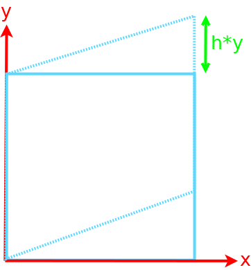

<section id="themes">
	<h2>Themes</h2>
		<p>
			Set your presentation theme: <br>
			<!-- Hacks to swap themes after the page has loaded. Not flexible and only intended for the reveal.js demo deck. -->
                        <a href="#" onclick="document.getElementById('theme').setAttribute('href','css/theme/black.css'); return false;">Black (default)</a> -
			<a href="#" onclick="document.getElementById('theme').setAttribute('href','css/theme/white.css'); return false;">White</a> -
			<a href="#" onclick="document.getElementById('theme').setAttribute('href','css/theme/league.css'); return false;">League</a> -
			<a href="#" onclick="document.getElementById('theme').setAttribute('href','css/theme/sky.css'); return false;">Sky</a> -
			<a href="#" onclick="document.getElementById('theme').setAttribute('href','css/theme/beige.css'); return false;">Beige</a> -
			<a href="#" onclick="document.getElementById('theme').setAttribute('href','css/theme/simple.css'); return false;">Simple</a> <br>
			<a href="#" onclick="document.getElementById('theme').setAttribute('href','css/theme/serif.css'); return false;">Serif</a> -
			<a href="#" onclick="document.getElementById('theme').setAttribute('href','css/theme/blood.css'); return false;">Blood</a> -
			<a href="#" onclick="document.getElementById('theme').setAttribute('href','css/theme/night.css'); return false;">Night</a> -
			<a href="#" onclick="document.getElementById('theme').setAttribute('href','css/theme/moon.css'); return false;">Moon</a> -
			<a href="#" onclick="document.getElementById('theme').setAttribute('href','css/theme/solarized.css'); return false;">Solarized</a>
		</p>
</section>

H:

# Transformations

Jean Pierre Charalambos

H:

## Index

 1. Intro<!-- .element: class="fragment" data-fragment-index="1"-->
    * Active vs pasive transformations
    * Shaders
 2. Linear transformations<!-- .element: class="fragment" data-fragment-index="2"-->
    * Scaling, rotation & shearing
 3. Affine transformations<!-- .element: class="fragment" data-fragment-index="3"-->
    * Homogeneous space
    * Translation
    * Scaling, rotation & shearing revisited
    * Matrix operations: inversion, composition

V:

## Index (part 2)

 4. Modelling and view<!-- .element: class="fragment" data-fragment-index="4"-->
 5. Projections<!-- .element: class="fragment" data-fragment-index="5"-->
    * Orthogonal
    * Perspective
 
H:

## Intro: Active vs pasive transformations

<font color="yellow"> Active Transformation (standard basis) vs Passive Transformation (change of basis)</font>


N:

* Standard = Canonical

V:

## Intro: Shaders

<div class="ulist">
    
    <ul style="width: 30%;">
        <p class="fragment" data-fragment-index="1">Vertex shader</p>
        <p class="fragment" data-fragment-index="2">Fragment shader</p>
    </ul>
</div>

V:

## Intro: Shaders
### Vertex shader: pseudo code

```glsl
for (int i = 0; i < vertexCount; i++) {
  output = vertexShader(vertex[i]);
}
```

V:

## Intro: Shaders
### Vertex shader

```glsl
uniform mat4 transform;
attribute vec4 vertex;
attribute vec4 color;
varying vec4 vertColor;

void main(){
   gl_Position = transform * vertex;
   vertColor = color;
}
```

V:

## Intro: Shaders
### Vertex shader: glsl code for active *transform*

```glsl
uniform mat4 transform;
attribute vec4 vertex;
attribute vec4 color;
varying vec4 vertColor;

void main(){
   gl_Position = transform * vertex;
   vertColor = color;
}
```

1. `transform = projection`
  
V:

## Intro: Shaders
### Vertex shader: glsl code for passive *transform*

```glsl
uniform mat4 transform;
attribute vec4 vertex;
attribute vec4 color;
varying vec4 vertColor;

void main(){
   gl_Position = transform * vertex;
   vertColor = color;
}
```

1. `transform = projection * modelview`
2. `transform = projection * view * model`

V:

## Intro: Shaders
### Fragment shader: pseudo code

```glsl
for (int i = 0; i < fragmentCount; i++) {
  screenBuffer[fragment[i].xy] = fragmentShader(fragment[i]);
}

function fragmentShader(fragment) {
  return fragment.litColor;
}
```

V:

## Intro: Shaders
### Fragment shader: glsl code

```glsl
varying vec4 vertColor;

void main(){
  gl_FragColor = vertColor;
}
```

H:

## Linear transformations: Notion

Property 1<!-- .element: class="fragment" data-fragment-index="1"-->
   $$F(a+b)= F(a)+ F(b)$$

Property 2<!-- .element: class="fragment" data-fragment-index="2"-->
   $$F(\lambda a) = \lambda F(a)\rightarrow F(0) = 0$$

Observation 1:<!-- .element: class="fragment" data-fragment-index="3"-->
   Matrix multiplication is always linear

Observation 2:<!-- .element: class="fragment" data-fragment-index="4"-->
   Translation is a nonlinear transformation
   
V:

## Linear transformations: 2d scaling

<div class="ulist">
    
    <ul style="width: 57%;">
        <p class="fragment" data-fragment-index="1">
        `$x'= sx*x$`
        </p>
        <p class="fragment" data-fragment-index="2">
        `$y'= sy*y$`
        </p>
        <p class="fragment" data-fragment-index="3">
        `$\begin{bmatrix} 
        x' \cr 
        y' \cr
        \end{bmatrix}
        = 
        \begin{bmatrix}
        sx & 0 \cr
        0 & sy \cr
        \end{bmatrix} \bullet \begin{bmatrix} 
        x \cr 
        y \cr
        \end{bmatrix}
        $`
        </p>
        <p class="fragment" data-fragment-index="4">
        $P'= S(sx,sy) \bullet P$
        </p>
    </ul>
</div>

N:

* mirroring and reflections are missed

V:

## Linear transformations: 3d scaling

<div class="ulist">
    
    <ul style="width: 65%;">
        <p class="fragment" data-fragment-index="1">
        `$x'= sx*x$`
        </p>
        <p class="fragment" data-fragment-index="2">
        `$y'= sy*y$`
        </p>
        <p class="fragment" data-fragment-index="3">
        `$z'= sz*z$`
        </p>
        <p class="fragment" data-fragment-index="4">
        `$\begin{bmatrix} 
        x' \cr 
        y' \cr
        z' \cr
        \end{bmatrix}
        = 
        \begin{bmatrix}
        sx & 0 & 0 \cr
        0 & sy & 0 \cr
        0 & 0 & sz \cr
        \end{bmatrix} \bullet \begin{bmatrix} 
        x \cr 
        y \cr
        z \cr
        \end{bmatrix}
        $`
        </p>
        <p class="fragment" data-fragment-index="5">
        $P'= S(sx,sy,sz) \bullet P$
        </p>
    </ul>
</div>

N:

* mirroring and reflections are missed

V:

## Linear transformations: 2d rotation

<div class="ulist">
    
    <ul style="width: 57%;">        
        <p class="fragment" data-fragment-index="1">
        $x = rcos \alpha$
        </p>
        <p class="fragment" data-fragment-index="2">
        $y= rsin \alpha$
        </p>
        <p class="fragment" data-fragment-index="3">
        $x'= rcos (\alpha+\beta)$
        $x'= rcos \alpha cos \beta - rsin \alpha sin \beta$
        </p>
        <p class="fragment" data-fragment-index="4">
        $y'= rsin (\alpha+\beta)$
        $y'= rcos \alpha sin \beta - rsin \alpha cos \beta$
        </p>
    </ul>
</div>

V:

## Linear transformations: 2d Rotation

<div class="ulist">
    
    <ul style="width: 57%;">        
        <p class="fragment" data-fragment-index="1">
        `$\begin{bmatrix} 
        x' \cr 
        y' \cr
        \end{bmatrix}
        = 
        \begin{bmatrix}
        cos\beta & -sin \beta \cr
        sin\beta & cos \beta \cr
        \end{bmatrix} \bullet \begin{bmatrix} 
        x \cr 
        y \cr
        \end{bmatrix}
        $`
        </p>
        <p class="fragment" data-fragment-index="2">
        $P'= R(\beta) \bullet P$
        </p>
    </ul>
</div>

V:

## Linear transformations: 3d rotation
### Euler angles (respect to z-axis)

<div class="ulist">
    
    <ul style="width: 67%;">
        <p class="fragment" data-fragment-index="1">
        $z' = z$
        </p>
        <p class="fragment" data-fragment-index="2">
        `$\begin{bmatrix} 
        x' \cr 
        y' \cr
        z' \cr
        \end{bmatrix}
        = 
        \begin{bmatrix}
        cos\beta & -sin \beta & 0 \cr
        sin\beta & cos \beta & 0 \cr
        0 & 0 & 1 \cr
        \end{bmatrix} \bullet \begin{bmatrix} 
        x \cr 
        y \cr
        z \cr
        \end{bmatrix}
        $`
        </p>
        <p class="fragment" data-fragment-index="3">
        $P'= R_z(\beta) \bullet P$
        </p>
    </ul>
</div>

V:

## Linear transformations: 3d rotation
### Euler angles (respect to x-axis)

<div class="ulist">
    
    <ul style="width: 67%;">
        <p class="fragment" data-fragment-index="1">
        $x' = x$
        </p>
        <p class="fragment" data-fragment-index="2">
        `$\begin{bmatrix} 
        x' \cr 
        y' \cr
        z' \cr
        \end{bmatrix}
        = 
        \begin{bmatrix}
        1 & 0 & 0 \cr
        0 & cos\beta & -sin \beta \cr
        0 & sin\beta & cos \beta \cr
        \end{bmatrix} \bullet \begin{bmatrix} 
        x \cr 
        y \cr
        z \cr
        \end{bmatrix}
        $`
        </p>
        <p class="fragment" data-fragment-index="3">
        $P'= R_x(\beta) \bullet P$
        </p>
    </ul>
</div>

V:

## Linear transformations: 3d rotation
### Euler angles (respect to y-axis)

<div class="ulist">
    
    <ul style="width: 67%;">
        <p class="fragment" data-fragment-index="1">
        $y' = y$
        </p>
        <p class="fragment" data-fragment-index="2">
        `$\begin{bmatrix} 
        x' \cr 
        y' \cr
        z' \cr
        \end{bmatrix}
        = 
        \begin{bmatrix}
        cos\beta & 0 & sin \beta \cr
        0 & 1 & 0 \cr
        -sin\beta & 0 & cos \beta \cr
        \end{bmatrix} \bullet \begin{bmatrix} 
        x \cr 
        y \cr
        z \cr
        \end{bmatrix}
        $`
        </p>
        <p class="fragment" data-fragment-index="3">
        $P'= R_y(\beta) \bullet P$
        </p>
    </ul>
</div>

V:

## Linear transformations: 2d shearing

<div class="ulist">
    
    <ul style="width: 57%;">
        <p class="fragment" data-fragment-index="1">
        `$x'= x + h*y$`
        </p>
        <p class="fragment" data-fragment-index="2">
        `$y'=y$`
        </p>
        <p class="fragment" data-fragment-index="3">
        `$\begin{bmatrix} 
        x' \cr 
        y' \cr
        \end{bmatrix}
        = 
        \begin{bmatrix}
        1 & h \cr
        0 & 1 \cr
        \end{bmatrix} \bullet \begin{bmatrix} 
        x \cr 
        y \cr
        \end{bmatrix}
        $`
        </p>
        <p class="fragment" data-fragment-index="4">
        $P'= D_x(h) \bullet P$
        </p>
    </ul>
</div>

V:

## Linear transformations: 2d shearing

<div class="ulist">
    
    <ul style="width: 57%;">
        <p class="fragment" data-fragment-index="1">
        `$x'= x$`
        </p>
        <p class="fragment" data-fragment-index="2">
        `$y'=y + h*x$`
        </p>
        <p class="fragment" data-fragment-index="3">
        `$\begin{bmatrix} 
        x' \cr 
        y' \cr
        \end{bmatrix}
        = 
        \begin{bmatrix}
        1 & 0 \cr
        h & 1 \cr
        \end{bmatrix} \bullet \begin{bmatrix} 
        x \cr 
        y \cr
        \end{bmatrix}
        $`
        </p>
        <p class="fragment" data-fragment-index="4">
        $P'= D_y(h) \bullet P$
        </p>
    </ul>
</div>

V:

## Linear transformations: 3d shearing

<div class="ulist">
    
    <ul style="width: 57%;">
        <p class="fragment" data-fragment-index="1">
        `$x'=x+az$`
        </p>
        <p class="fragment" data-fragment-index="2">
        `$y'=y+bz$`
        </p>
        <p class="fragment" data-fragment-index="3">
        `$z'=z$`
        </p>
        <p class="fragment" data-fragment-index="4">
        `$\begin{bmatrix} 
        x' \cr 
        y' \cr
        z' \cr
        \end{bmatrix}
        = 
        \begin{bmatrix}
        1 & 0 & a \cr
        0 & 1 & b \cr
        0 & 0 & 1 \cr
        \end{bmatrix} \bullet \begin{bmatrix} 
        x \cr 
        y \cr
        z \cr
        \end{bmatrix}
        $`
        </p>
        <p class="fragment" data-fragment-index="5">
        $P'= D_z(a,b) \bullet P$ (<a href="#/5/4">go to 2d translation</a>)
        </p>
    </ul>
</div>

V:

## Linear transformations: 3d shearing

...don't forget $P'= D_x(a,b) \bullet P$ and $P'= D_y(a,b) \bullet P$

H:

## Affine transformations
### Non-linearity of translation

<div class="ulist">
    
    <ul style="width: 57%;">
        <p class="fragment" data-fragment-index="1">
        `$x'= x + dx$`
        </p>
        <p class="fragment" data-fragment-index="2">
        `$y'=y + dy$`
        </p>
        <p class="fragment" data-fragment-index="3">
        `$\begin{bmatrix} 
        x' \cr 
        y' \cr
        \end{bmatrix}
        = 
        \begin{bmatrix}
        dx \cr
        dy \cr
        \end{bmatrix} + \begin{bmatrix} 
        x \cr 
        y \cr
        \end{bmatrix}
        $`
        </p>
        <p class="fragment" data-fragment-index="4">
        $P'= T(dx,dy) + P$
        </p>
    </ul>
</div>

V:

## Affine transformations: Notion

<p align ="center">
Linear transformations $+$ Translation $\rightarrow P' = M\ast P + T $
</p>

V:

## Affine transformations: Homogeneous space $\rightarrow$ 2d

<div class="ulist">
    
    <ul style="width: 57%;">
        <p class="fragment" data-fragment-index="1">
        Homogeneous w-coordinate: $(x,y,w)$
        </p>
        <p class="fragment" data-fragment-index="2">
        Homogeneous space $\rightarrow$ 2d
        </p>
        <p class="fragment" data-fragment-index="3">
        $(x,y,1) \rightarrow (x,y)$, for $w=1$
        </p>
        <p class="fragment" data-fragment-index="4">
        In general: $(x,y,w) \rightarrow (x/w,y/w)$
        </p>
    </ul>
</div>

V:

## Affine transformations: Homogeneous space $\rightarrow$ 3d

<p class="fragment" data-fragment-index="1">
$(x,y,z,1) \rightarrow (x,y,z)$, for $w=1$
</p>
<p class="fragment" data-fragment-index="2">
In general: $(x,y,z,w) \rightarrow (x/w,y/w,z/w)$
</p>

V:

## Affine transformations:Translation

<div class="ulist">
    
    <ul style="width: 57%;">
        <p class="fragment" data-fragment-index="1">
        `$x'= x + dx$`
        </p>
        <p class="fragment" data-fragment-index="2">
        `$y'=y + dy$`
        </p>
        <p class="fragment" data-fragment-index="3">
        `$w=1$`
        </p>
        <p class="fragment" data-fragment-index="4">
        `$\begin{bmatrix} 
        x' \cr 
        y' \cr
        w \cr
        \end{bmatrix}
        = 
        \begin{bmatrix}
        1 & 0 & dx \cr
        0 & 1 & dy \cr
        0 & 0 & 1 \cr
        \end{bmatrix} \bullet \begin{bmatrix} 
        x \cr 
        y \cr
        1 \cr
        \end{bmatrix}
        $`
        </p>
        <p class="fragment" data-fragment-index="5">
        $P'= T(dx,dy) \bullet P$ (<a href="#/4/10">go to 3d shearing</a>)
        </p>
    </ul>
</div>

V:

## Affine transformations:Translation

<div class="ulist">
    
    <ul style="width: 57%;">
        <p class="fragment" data-fragment-index="1">
        `$x'= x + dx$`
        </p>
        <p class="fragment" data-fragment-index="2">
        `$y'=y + dy$`
        </p>
        <p class="fragment" data-fragment-index="3">
        `$z'=z + dz$`
        </p>
        <p class="fragment" data-fragment-index="4">
        `$\begin{bmatrix} 
        x' \cr 
        y' \cr
        z' \cr
        w \cr
        \end{bmatrix}
        = 
        \begin{bmatrix}
        1 & 0 & 0 & dx \cr
        0 & 1 & 0 & dy \cr
        0 & 0 & 1 & dz \cr
        0 & 0 & 0 & 1 \cr
        \end{bmatrix} \bullet \begin{bmatrix} 
        x \cr 
        y \cr
        z \cr
        1 \cr
        \end{bmatrix}
        $`
        </p>
        <p class="fragment" data-fragment-index="5">
        $P'= T(dx,dy,dz) \bullet P$
        </p>
    </ul>
</div>

V:

## Affine transformations: Shearing (r)

<div class="ulist">
    
    <ul style="width: 57%;">
        <p>
        `$x'=x+az$`
        </p>
        <p>
        `$y'=y+bz$`
        </p>
        <p>
        `$z'=z$`
        </p>
        <p>
        `$w=1$`
        </p>
        <p>
        `$\begin{bmatrix} 
        x' \cr 
        y' \cr
        z' \cr
        w \cr
        \end{bmatrix}
        = 
        \begin{bmatrix}
        1 & 0 & a & 0 \cr
        0 & 1 & b & 0 \cr
        0 & 0 & 1 & 0 \cr
        0 & 0 & 0 & 1 \cr
        \end{bmatrix} \bullet \begin{bmatrix} 
        x \cr 
        y \cr
        z \cr
        1 \cr
        \end{bmatrix}
        $`
        </p>
        <p>
        $P'= D_z(a,b) \bullet P$
        </p>
    </ul>
</div>

V:

## Affine transformations: Scaling (r)

<div class="ulist">
    
    <ul style="width: 65%;">
        <p>
        `$x'= sx*x$`
        </p>
        <p>
        `$y'= sy*y$`
        </p>
        <p>
        `$z'= sz*z$`
        </p>
        <p>
        `$w=1$`
        </p>
        <p>
        `$\begin{bmatrix} 
        x' \cr 
        y' \cr
        z' \cr
        w \cr
        \end{bmatrix}
        = 
        \begin{bmatrix}
        sx & 0 & 0 & 0 \cr
        0 & sy & 0 & 0 \cr
        0 & 0 & sz & 0 \cr
        0 & 0 & 0 & 1 \cr
        \end{bmatrix} \bullet \begin{bmatrix} 
        x \cr 
        y \cr
        z \cr
        1 \cr
        \end{bmatrix}
        $`
        </p>
        <p>
        $P'= S(sx,sy,sz) \bullet P$
        </p>
    </ul>
</div>


V:

## Affine transformations: 3d rotation (r)
### Euler angles (respect to z-axis)

<div class="ulist">
    
    <ul style="width: 67%;">
        <p>
        $z' = z$
        </p>
        <p>
        `$w=1$`
        </p>
        <p>
        `$\begin{bmatrix} 
        x' \cr 
        y' \cr
        z' \cr
        w \cr
        \end{bmatrix}
        = 
        \begin{bmatrix}
        cos\beta & -sin \beta & 0 & 0 \cr
        sin\beta & cos \beta & 0 & 0 \cr
        0 & 0 & 1 & 0 \cr
        0 & 0 & 0 & 1 \cr
        \end{bmatrix} \bullet \begin{bmatrix} 
        x \cr 
        y \cr
        z \cr
        1 \cr
        \end{bmatrix}
        $`
        </p>
        <p>
        $P'= R_z(\beta) \bullet P$
        </p>
    </ul>
</div>

V:

## Affine transformations: 3d rotation (r)
### Euler angles (respect to x-axis)

<div class="ulist">
    
    <ul style="width: 67%;">
        <p>
        $x' = x$
        </p>
        <p>
        `$w=1$`
        </p>
        <p>
        `$\begin{bmatrix} 
        x' \cr 
        y' \cr
        z' \cr
        w \cr
        \end{bmatrix}
        = 
        \begin{bmatrix}
        1 & 0 & 0 & 0 \cr
        0 & cos\beta & -sin \beta & 0 \cr
        0 & sin\beta & cos \beta & 0 \cr
        0 & 0 & 0 & 1 \cr
        \end{bmatrix} \bullet \begin{bmatrix} 
        x \cr 
        y \cr
        z \cr
        1 \cr
        \end{bmatrix}
        $`
        </p>
        <p>
        $P'= R_x(\beta) \bullet P$
        </p>
    </ul>
</div>

V:

## Affine transformations: 3d rotation (r)
### Euler angles (respect to y-axis)

<div class="ulist">
    
    <ul style="width: 67%;">
        <p>
        $y' = y$
        </p>
        <p>
        `$w=1$`
        </p>
        <p>
        `$\begin{bmatrix} 
        x' \cr 
        y' \cr
        z' \cr
        w \cr
        \end{bmatrix}
        = 
        \begin{bmatrix}
        cos\beta & 0 & sin \beta & 0 \cr
        0 & 1 & 0 & 0 \cr
        -sin\beta & 0 & cos \beta & 0 \cr
        0 & 0 & 0 & 1 \cr
        \end{bmatrix} \bullet \begin{bmatrix} 
        x \cr 
        y \cr
        z \cr
        1 \cr
        \end{bmatrix}
        $`
        </p>
        <p>
        $P'= R_y(\beta) \bullet P$
        </p>
    </ul>
</div>

V:

## Affine transformations: Rotation
### Orthogonal matrix

V:

## Affine transformations: Rotation
### Quaternions

V:

## Affine transformations: Matrix operations
### Inversion

Let $M$ be an affine transformation matrix such that:

$$P'=MP$$

<!-- .element: class="fragment" data-fragment-index="1"-->

Let $M^{-1}$ be the inverse of $M$. Observe that:

<!-- .element: class="fragment" data-fragment-index="2"-->

$$M^{-1}P'=M^{-1}MP=(M^{-1}M)P=IP=P$$

<!-- .element: class="fragment" data-fragment-index="3"-->

V:

## Affine transformations: Matrix operations
### Affine inverse matrices

| Transformation |    Direct     |      Inverted       |
|----------------|---------------|---------------------|
| Translation    | $T(dx,dy,dz)$ |   $T(-dx,-dy,-dz)$  |
| Shearing       |   $D_z(a,b)$  |     $D_z(-a,-b)$    |
| Scaling        | $S(sx,sy,sz)$ | $S(1/sx,1/sy,1/sz)$ |
| Rotation       |  $R_z(\beta)$ |    $R_z(-\beta)$    |

V:

## Affine transformations: Matrix operations
### Composition

Consider the following sequence of transformations:

`$P_1=M_1P,$` <!-- .element: class="fragment" data-fragment-index="1"-->
`$P_2=M_2P_1,$` <!-- .element: class="fragment" data-fragment-index="2"-->
`$...,$` <!-- .element: class="fragment" data-fragment-index="3"-->
`$P_n=M_nP_n-1,$` <!-- .element: class="fragment" data-fragment-index="4"-->

`which may simply be written as: $P_n=M_n...M_2M_1P$`<!-- .element: class="fragment" data-fragment-index="5"-->

Mnemonic rule 1:<!-- .element: class="fragment" data-fragment-index="6"-->
   The (right-to-left) $M_1,M_2...M_n$ sequence is performed respect to a world (fixed) coordinate system

Mnemonic rule 2:<!-- .element: class="fragment" data-fragment-index="7"-->
   The (left-to-right) $M_n,...M_2M_1$ sequence is performed respect to a local (mutable) coordinate system
   
V:

## Affine transformations: Matrix operations
### Composition: Examples

<figure>
    
    <figcaption>Rotation respect to pivot $(x_r,y_r)$, angle = $\beta$</figcaption>
</figure>

V:

## Affine transformations: Matrix operations
### Composition: Examples

<figure>
    
    <figcaption>$T(x_r,y_r)R_z(\beta)T(-x_r,-y_r)P$</figcaption>
</figure>

V:

## Affine transformations: Matrix operations
### Composition: Examples

<figure>
    
    <figcaption>Scaling respect to reference point $(x_f,y_f)$</figcaption>
</figure>

V:

## Affine transformations: Matrix operations
### Composition: Examples

<figure>
    
    <figcaption>$T(x_f,y_f)$S(sx,sy)$(-x_r,-y_r)P$</figcaption>
</figure>

H:

## Modelling and view

Any (homogeneous matrix) transform represents a change (of basis) of a coordinate system, i.e., passive transformation

Matrix stack stuff goes here!

H:

## Projections: Orthogonal

V:

## Projections: Perspective

H:

## References

* [Math primer for graphics and game development](https://tfetimes.com/wp-content/uploads/2015/04/F.Dunn-I.Parberry-3D-Math-Primer-for-Graphics-and-Game-Development.pdf)
* [Processing 2d transformations tutorial](https://www.processing.org/tutorials/transform2d/)
* [Processing shaders tutorial](https://www.processing.org/tutorials/pshader/)

H:

## Credits

* [Jean Pierre Alfonso](https://www.linkedin.com/in/jean-pierre-alfonso-hoyos-59b46359/), for the initial draft of the presentation which included the [mathjax](https://www.mathjax.org/) formulas
